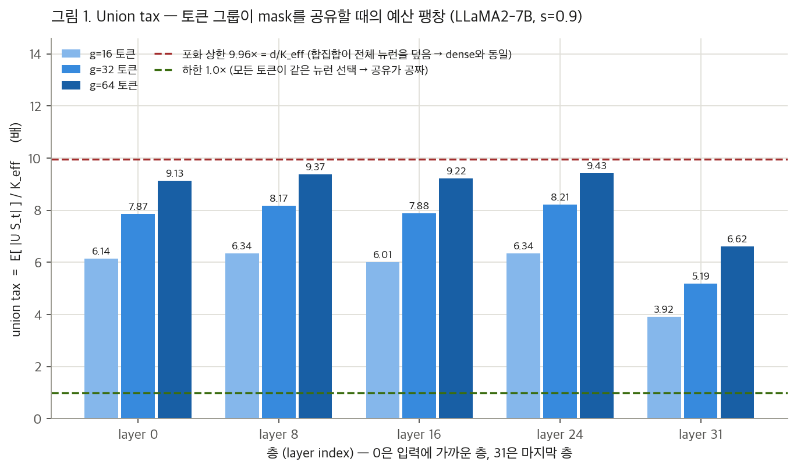

# Co-activation 블록 구조 탐구 — P1 · P2 · P3 종합 리포트

**주제(topic)**: `coactivation-block-structure` · **모델**: LLaMA2-7B · **데이터**: wikitext-2 test
**작성일**: 2026-07-28 · **실험 수행일**: 2026-07-25 · **실행 호스트**: a6000-4 (RTX A6000 48GB ×1)
**스펙 출처**: `research-wiki/plans/coactivation-block-structure-spec.md`
**저널 카드**: `.labtool/topics/coactivation-block-structure/journal/` (P1/P2/P3 각 1장)

---

## 0. 한눈에

FFN 중간층 뉴런을 **재배열(치환)** 해서 토큰 그룹이 mask를 공유할 때의 손실을 줄일 수 있는지
물었다. 세 단계 게이트로 검증했고, 결론은 **"구조는 실재하지만 그것만으로는 작동하지 않는다"** 이다.

| 단계 | 무엇을 했나 | 사전 등록 기준 | 결과 | 판정 |
|---|---|---|---|---|
| **P1** | 동시활성 통계 수집 + 그룹 공유 세금 측정 | 정상 범위 내 수집 | union tax 6.0–9.4× (상한 9.96×) | 통과 — 문제 크기 정량화 |
| **P2** | PPMI 클러스터링 + 구조 평가 | 무작위 대비 ≥ 1.3× | 질량 1.25–4.12×, coverage 1.5–4.2× | 통과 — 단, 절대 coverage 0.20–0.36 |
| **P3** | 블록 mask oracle PPL | 앵커 대비 ΔPPL ≤ +1.0 | PPL 4,539–23,919 (앵커 8.11) | **미달 (3–4자릿수)** |

핵심 세 문장:

1. 순진한 union 공유는 **P1에서 이미 사망**했다 — g=64 그룹 하나가 전체 뉴런의 92%를 건드린다.
2. 동시활성 클러스터링은 **진짜 구조를 찾아낸다** — 무작위 재배열 대비 최대 4.1배, 그리고 이 우위는
   PPL에서도 (4개 중 3개 설정에서 2–3배로) 재현된다.
3. 그러나 예산 안의 블록이 토큰 선택의 **20–36%만 덮으므로**, 32개 층에 걸쳐 누적되면 모델이
   무너진다. 치환은 **단독 기법이 아니라 부품**이다.

총 GPU 사용 시간: **약 32분** (P1 1분28초 + P2 3분23초 + P3 prep 10분17초 + P3 eval 17분17초).

---

## 1. 왜 이 실험을 했나

### 1.1 출발점 — 공유의 유혹과 세금

LLaMA2-7B의 FFN은 토큰마다 d = 11,008개의 중간 뉴런을 계산한다.

```
FFN(x) = W_d · i,    i = u ⊙ g,    u = W_u x,    g = σ(W_g x)
```

여기서 크기가 큰 상위 10%만 남기고 나머지를 0으로 만드는 것이 per-token Top-K sparsification이다
(s = 0.9, 토큰당 K = ⌊(1−s)·d⌋ ≈ 1,101개 생존). 선행 실험에서 이 방식이 PPL 5.47 → 8.11로
동작함을 확인했다.

문제는 **커널 효율**이다. 토큰마다 다른 뉴런을 읽으면 가중치 행렬 접근이 흩어져 실제 속도 이득이
작다. 연속된 토큰 g개(16/32/64)가 **같은 mask를 공유**하면 한 번 읽은 가중치 타일을 재사용할 수
있어 훨씬 빠르다. 그런데 선행 측정에 따르면 인접 토큰끼리도 선택의 68%가 불일치한다 — 공유에는
비싼 세금이 붙는다.

### 1.2 가설 — 치환은 공짜 자유도다

`i = u ⊙ g`는 elementwise 곱이므로, 이 구조와 교환되는 함수보존 변환은 monomial(치환 × 대각
스케일링)뿐이다. 즉 **뉴런의 번호를 바꿔 다는 것(치환)은 모델을 전혀 바꾸지 않는다.** 출력이
비트 단위로 동일하다. 그렇다면:

> **"함께 켜지는 뉴런"들을 미리 같은 블록에 모아 재배열하면, 그룹 공유 mask가 '뉴런 1,101개
> 고르기'에서 '블록 몇 개 고르기'로 바뀌어 세금을 블록 수준에서 흡수할 수 있는가?**

### 1.3 검증 설계 — 싼 것부터 세 단계 게이트

| 단계 | 성격 | 비용 | 실패하면 |
|---|---|---|---|
| P1 | 관측 (판단 없음) | 1.5분 | — |
| P2 | 구조 검증 (모델 실행 최소) | 3.4분 | 축 즉시 기각, P3 생략 |
| P3 | 성능 판정 (전 층 PPL) | 27분 | 축 기각 또는 결합 방식 재설계 |

각 단계의 성공 기준은 **결과를 보기 전에** 정해 카드에 기록했다(사전 등록). 이는 결과가 나온 뒤
기준을 옮기는 편향을 막기 위한 것으로, P3의 미달 판정도 이 규칙에 따른 것이다.

---

## 2. 공통 조건과 표기

### 2.1 표기

| 기호 | 의미 | 값 (LLaMA2-7B) |
|---|---|---|
| `d` | FFN 중간 차원 (뉴런 수) | 11,008 |
| `L` | 층 수 | 32 |
| `s` | sparsity (0으로 만드는 비율) | 0.9 |
| `K` | 토큰당 생존 뉴런 수 = ⌊(1−s)·d⌋ | 1,101 |
| `K_eff` | 실측 평균 생존 수 | 1,104–1,108 |
| `S_t` | 토큰 t의 생존 뉴런 집합 | \|S_t\| = K_eff |
| `f_j` | 뉴런 j의 선택 빈도 | — |
| `g` | 그룹 크기 (mask를 공유하는 연속 토큰 수) | 16 / 32 / 64 |
| `B` | 블록 크기 (재배열 후 한 블록의 뉴런 수) | 64 / 128 / 256 |
| `m` | 선택하는 블록 개수 (m·B ≈ K) | B=64 → 17, B=256 → 4 |

`K_eff`가 명목값 1,101보다 0.4% 큰 이유: 생존 여부를 `down_proj` 입력이 0이 아닌지로 판독하기
때문에, Top-K 밖이면서 값이 정확히 0인 경우와 동점 처리가 미세하게 포함된다. 선행 overlap 실험도
같은 규약(K_eff = 1,106)이라 비교 가능하다.

### 2.2 실험 조건

- **측정 대상**: 실제로 sparsify된 forward (층 L의 선택이 상류 sparsification의 영향을 반영).
  dense 활성값에서 사후 계산한 것이 아니다.
- **데이터**: wikitext-2 test. P1/P2는 32 × 2,048 = 65,536 토큰, P3 PPL은 전체 166 × 2,048 =
  339,968 토큰.
- **정밀도**: 모델 bfloat16, 통계 누적과 블록 점수 계산은 fp32.
- **attention backend**: sdpa (a6000-4에 flash-attn 없음). 선행 게이트에서 backend 차이는
  PPL ~1e-3 수준으로 확인됨.
- **관측 지점**: 모든 통계는 `down_proj`의 입력에 건 forward hook에서 읽는다.

---

## 3. P1 — 동시활성 통계 수집

> 잡 `20260725-000051-coact-llama2-p1-stats` · 1분 28초 · STATUS=ok
> 산출물 `llama2_coactivation_s09.pt` (6.8 GB)

### 3.1 의도

두 가지를 잰다. **해결의 원료**(어떤 뉴런들이 함께 켜지는가)와 **문제의 크기**(순진한 공유가
얼마나 비싼가). 판단은 하지 않는다 — 이 단계는 순수 관측이다.

층 전체(32개)를 재면 d×d 행렬이 32개(각 484MB)라 과하므로, **샘플 층 {0, 8, 16, 24, 31}** 로
시작했다. 층 31은 선행 실험에서 유일하게 뉴런 사용이 집중된 예외 층이라 필수 포함이다.

### 3.2 무엇을 어떻게 계산했나

토큰 t마다 생존 여부를 bool 벡터 `sel[t, :]`로 기록한 뒤, 다음을 **전수 누적**한다(표본 추정이
아니다).

```
선택 빈도       f_j    = (뉴런 j가 켜진 토큰 수) / (전체 토큰 수)
동일 토큰       A_jj'  = E_t [ 1[j ∈ S_t] · 1[j' ∈ S_t] ]          ← selᵀ·sel 행렬곱으로 누적
윈도우 g        A^g_jj' = E_{|t−t'| < g} [ 1[j ∈ S_t] · 1[j' ∈ S_t'] ]   ← 토큰축 cumsum 후 1회 행렬곱
```

- `A`는 "같은 토큰에서 함께 켜지는가", `A^g`는 "가까운 토큰(거리 < g)에서 함께 켜지는가"다.
  그룹 공유에서는 후자가 직접적으로 중요하다. 수집한 윈도우는 g ∈ {16, 64} (P3 스윕 격자와 일치).
- 카운트 최대값이 65,536 × ... < 2²⁴이므로 fp32 행렬곱으로 정확히 누적된다(반올림 없음).
- PMI/Jaccard 같은 정규화 지표는 원 카운트와 정규화 상수를 저장해두고 **P2에서 파생**한다.

### 3.3 지표 정의 — union tax

| 항목 | 내용 |
|---|---|
| **수식** | `union tax(g) = E[ \|∪_{t∈group} S_t\| ] / K_eff` |
| **계산** | 시퀀스를 연속 g토큰씩 자르고, 각 그룹이 켠 뉴런의 합집합 크기를 세어 K_eff로 나눈 뒤 전 그룹 평균 |
| **의미** | 그룹 전체를 한 토큰처럼 취급해 union mask를 쓸 때, **토큰 하나 예산의 몇 배**가 필요한가 |
| **하한** | **1.0×** — 그룹의 모든 토큰이 같은 뉴런을 선택 (공유가 공짜) |
| **상한** | **d / K_eff ≈ 9.96×** — 합집합이 전체 11,008개 뉴런을 덮음 (dense와 동일, 공유의 의미 소멸) |

### 3.4 결과

| 층 | K_eff | union tax g=16 | g=32 | g=64 | g=64가 상한의 몇 % |
|---|---|---|---|---|---|
| 0 | 1,105 | 6.14× | 7.87× | 9.13× | 92% |
| 8 | 1,108 | 6.34× | 8.17× | 9.37× | 94% |
| 16 | 1,107 | 6.01× | 7.88× | 9.22× | 93% |
| 24 | 1,106 | 6.34× | 8.21× | 9.43× | 95% |
| 31 | 1,105 | 3.92× | 5.19× | 6.62× | 66% |



**그림 1 읽는 법**

- **x축**: 관측한 층 번호. 왼쪽(layer 0)이 입력에 가깝고 오른쪽(layer 31)이 마지막 층이다.
  다섯 개만 있는 이유는 샘플 층만 측정했기 때문이다.
- **y축**: union tax(배). "이 그룹의 mask를 union으로 만들면 토큰 1개 예산의 몇 배가 드는가".
  1.0이면 추가 비용 없음, 9.96이면 전체 뉴런을 다 켜는 것과 같다.
- **막대 3개**: 그룹 크기 g = 16 / 32 / 64 토큰. 오른쪽(진한 색)일수록 더 많은 토큰이 mask를
  공유한다.
- **빨간 점선(9.96×)**: 포화 상한. 여기 닿으면 union mask는 dense와 구별되지 않는다.
- **초록 점선(1.0×)**: 하한. 공유가 공짜인 이상적 상황.
- **막대 위 숫자**: 실측 배율. 예를 들어 layer 24 · g=64의 9.43은 "64토큰 그룹 하나가 평균
  9.43 × 1,106 ≈ 10,430개 뉴런을 건드린다"는 뜻이다.

### 3.5 해석

- **순진한 union 공유는 g=64에서 사망**했다. 상한의 92–95%에 도달했다는 것은, 64토큰이 필요한
  뉴런을 다 켜주면 전체의 약 95%를 켜는 셈이라 sparsity의 의미가 사라진다는 뜻이다.
- g=16에서도 이미 6배다. 즉 이후 살아남을 수 있는 방식은 "그룹이 건드리는 걸 다 켠다"가 아니라
  **"예산을 정해 그 안에서만 고른다"** 뿐이다. 이 결론이 P3의 설계(top-m 블록 선택)를 강제했다.
- **layer 31만 예외**(g=64에서 6.62×). 선행 실험에서 이 층만 Gini 0.705로 집중형이었던 것과
  일관된다. 층별 차등 전략(마지막 층은 고정 집합)의 근거가 하나 더 쌓였다.

---

## 4. P2 — 클러스터링과 구조 평가

> 잡 `20260725-004032-coact-llama2-p2-blocks` · 3분 23초 · STATUS=ok
> 산출물 `llama2_coactivation_blocks_s09.pt` (5.1 MB, 분할 결과 포함)

### 4.1 의도와 사전 등록된 기각 규칙

비싼 PPL 실험 전에 **싸게 거르는 관문**이다. 핵심 질문: "동시활성으로 묶은 블록이 아무 의미 없는
무작위 재배열보다 정말 나은가?"

> **사전 등록**: 무작위 균형 분할 대비 **1.3배 미만**이면 치환 축을 기각하고 아이디어 A(백본+잔차)
> 또는 D(학습)로 우선순위를 옮긴다.

무작위 통제군을 쓰는 이유가 중요하다. 뉴런을 아무렇게나 블록으로 잘라도 "블록 안에 동시활성이
얼마간 존재"하는 것은 당연하다. 우리가 알고 싶은 건 **클러스터링이 추가로 벌어들인 몫**이므로,
같은 크기의 무작위 균형 분할을 기준선으로 두고 배율로 본다.

### 4.2 파이프라인

```
A, f  ──▶  PPMI_jj' = max(0, log( A_jj' / (f_j · f_j') ))     ← 빈도 효과 제거
      ──▶  W_n = D^(−1/2) · PPMI · D^(−1/2)                    ← 정규화 라플라시안
      ──▶  상위 64개 고유벡터 → 행 정규화                       ← spectral embedding
      ──▶  balanced k-means (블록당 정확히 B개, 25 iter)        ← 균형 분할
```

**PMI를 쓰는 이유**: 분모 `f_j · f_j'`는 두 뉴런이 서로 무관하게 켜질 때 기대되는 동시활성률이다.
따라서 PMI > 0은 "우연 이상으로 함께 켜지는 진짜 동료 관계"를 뜻한다. 원시 `A`를 그대로 쓰면
"둘 다 자주 켜져서 우연히 겹치는" 쌍이 과대평가된다. 음수 부분을 0으로 자른 PPMI를 쓰는 것은
spectral 방법이 비음수 유사도를 요구하기 때문이다.

**균형(balanced) 분할인 이유**: 커널 효율이 목적이므로 블록 크기가 들쭉날쭉하면 의미가 없다.
모든 블록이 정확히 B개를 갖도록 용량 제약을 걸었다.

### 4.3 지표 3종

**① within-block mass (블록 내부 동시활성 질량)**

| 항목 | 내용 |
|---|---|
| 수식 | `Σ_{j≠j', 같은 블록} A_jj' / Σ_{j≠j'} A_jj'` |
| 의미 | 전체 동시활성 질량 중 블록 **내부에** 갇힌 비율. 클러스터링이 직접 최적화하는 목적에 가장 가까운 지표 |
| 기준선 | 무작위 균형 분할의 이론값 `(B−1)/(d−1)` = 0.0057 (B=64) / 0.0115 (B=128) / 0.0232 (B=256) — **실측 무작위 값과 정확히 일치**(sanity 확인) |

**② coverage @ 예산 (예산 안의 블록이 선택을 얼마나 덮는가)**

| 항목 | 내용 |
|---|---|
| 수식 | 토큰마다 선택된 뉴런이 많은 순으로 블록 m개(m·B ≈ K)를 고른 뒤, `(그 블록들 안에 든 선택 뉴런 수) / K_t` |
| 의미 | **실제 손실률의 대리 지표**. 1.0이면 블록 mask가 per-token 선택을 완전히 재현, 0.3이면 70%를 잃는다 |
| 기준선 | 무작위 분할 0.12–0.17. (단순 예산 비율 m·B/d = 0.099보다 높은 이유: 무작위 블록도 토큰마다 "가장 많이 켜진 블록"을 고르기 때문 — 순서통계량 효과) |

**③ block-level union tiling (블록이 합집합을 얼마나 촘촘히 담는가)**

| 항목 | 내용 |
|---|---|
| 수식 | `(그룹이 건드린 블록 수 × B) / \|∪ S_t\|` |
| 의미 | 1.0에 가까울수록 합집합이 블록 경계와 잘 맞아떨어짐 |
| 기준선 | 1.0 (완벽한 타일링) ~ `d/\|∪\|` (모든 블록을 건드림) |

### 4.4 결과


**그림 2 읽는 법**

- **x축**: 층. 괄호 안 숫자는 **클러스터 ÷ 무작위 배율**(예: layer 0의 2.15×).
- **y축**: coverage(0–1). "예산 안의 블록 m개가 그 토큰이 실제 고른 K_t개 중 몇 %를 담고
  있는가". 이 값이 1에 가까울수록 블록 mask가 per-token 선택에 근접한다.
- **파란 막대**: PPMI 클러스터 블록 / **회색 막대**: 무작위 균형 블록(통제군).
- 그림은 B=64 기준이며, B=128/256도 같은 양상이다.
- **주의해서 볼 점**: 배율(1.5–3.4×)은 좋지만 **절대값**이 중간층에서 0.25–0.36에 머문다.
  즉 토큰이 원한 뉴런의 **64–75%가 예산 밖 블록에 있어 잘려나간다**. 이 숫자가 P3 결과를 미리
  예고한다.


**그림 3 읽는 법**

- **x축**: 층. **y축**: 배율 = (클러스터 블록의 within-block mass) ÷ (무작위 블록의 값).
  절대값이 아니라 **비율**이라는 점이 중요하다 — 블록에 자른다는 행위 자체의 효과를 제거하고
  클러스터링이 추가로 벌어들인 몫만 본다.
- **막대 3개**: 블록 크기 B = 64 / 128 / 256. 블록이 커질수록 배율이 조금씩 낮아지는데,
  큰 블록은 무작위여도 더 많은 질량을 담기 때문이다(기준선 자체가 커진다).
- **빨간 점선(1.3×)**: 사전 등록한 기각 문턱. **회색 점선(1.0×)**: 무작위와 동일 = 구조 없음.
- **결과**: 15개 (층, B) 설정 중 **13개 통과**. 유일한 미달은 layer 8 · B=256 (1.25×)이고
  layer 8 · B=128 (1.32×)은 경계선이다. layer 31은 3.77–4.12×로 압도적이다.

**block-level union tiling — 판정 불능(포화)**

| g | 클러스터 | 무작위 | 비고 |
|---|---|---|---|
| 16 | 1.57–1.66 (L31: 2.58) | **동일** | 소수점 둘째 자리까지 일치 |
| 64 | 1.06–1.09 (L31: 1.52) | **동일** | 〃 |

이것은 "동점"이 아니라 **지표가 천장에 닿은 것**이다. P1에서 봤듯 그룹 합집합이 뉴런의 62–92%를
차지하므로, 어떤 균형 분할이든 그룹은 사실상 **모든 블록을 건드린다**. 따라서 값이 `d/|∪|`로
고정되고 분할 품질을 구별하지 못한다. 실질적 함의는 분명하다 — **"그룹이 건드리는 블록을 켠다"는
방식은 분할을 아무리 잘해도 구제 불가**이며, 남은 길은 예산 기반 top-m 선택뿐이다.

### 4.5 해석

- 관문 **통과**: 동시활성 구조는 실재하고, 무작위 재배열로는 재현되지 않는다.
- 그러나 두 개의 경고가 함께 나왔다. ① union tiling 경로 폐쇄(위), ② **절대 coverage가 낮다**.
- 이 시점에서 판단: "무작위보다 훨씬 낫다"와 "쓸 만하다"는 다르다. 기대치를 낮춘 채 P3로 진행.

---

## 5. P3 — 블록 mask oracle PPL

> 잡 `20260725-033520-coact-llama2-p3-prep` (10분 17초) + `20260725-034614-coact-llama2-p3-ppl` (17분 17초) · 둘 다 STATUS=ok
> 산출물 `llama2_p3_partitions_s09.pt` (11 MB, 전 32층 분할), `llama2_p3_block_ppl_s09.pt`

### 5.1 의도 — 왜 "oracle"인가

최종 판관은 실제 언어모델 성능(PPL)이다. 여기서는 블록 선택에 **그룹의 실제 활성값을 사용**한다
(그룹 안에서 비인과적). 실전에서는 예측기가 활성값을 보기 전에 블록을 골라야 하므로 이보다 나을 수
없다. 즉 이 측정은 **치환 축이 낼 수 있는 성능 상한**이다 — 상한이 무너지면 축 전체가 무너진다.

전 32층을 클러스터링해서(prep) 모든 층에 동시에 적용했다. per-token 앵커도 모든 층에 적용되므로
공정한 비교다.

### 5.2 마스킹 규칙

연속 g토큰 그룹마다:

```
블록 점수    score_b = Σ_{t ∈ group} Σ_{j ∈ b}  ‖W_d[:,j]‖₂ · |i_{t,j}|
선택         상위 m개 블록 (m = round(K/B))
적용         그룹 안 모든 토큰이 그 블록들의 뉴런만 사용
```

**가중치를 곱하는 이유(gauge 고정)**: `i = u ⊙ g`는 뉴런별 스케일을 `W_d` 열로 옮길 수 있어
`|i_j|`만으로는 중요도가 애매하다. `‖W_d[:,j]‖·|i_j|`는 그 뉴런이 출력에 실제로 기여하는 크기라
스케일 자유도에 불변이다. 이 정의는 oracle 스레드(H2)와 공유한다.

**비교군 4종** (모두 동일 프로토콜: 전체 test 166 × 2,048 토큰):

| arm | 설명 | 역할 |
|---|---|---|
| dense | sparsity 0 | 성능 천장 |
| per-token top-K | 토큰별 자유 선택, 같은 예산 | **앵커** — 공유하지 않으면 얼마인가 |
| block / clustered | PPMI 블록 + 그룹 공유 | 실험군 |
| block / random | 무작위 블록 + 그룹 공유 | **통제군** — 구조의 몫 분리 |

### 5.3 결과

| B | g | m | 실제 예산 | clustered | random | 앵커 대비 |
|---|---|---|---|---|---|---|
| 64 | 16 | 17 | 1,088 (98.8%) | **4,539** | 9,674 | +4,531 |
| 64 | 64 | 17 | 1,088 (98.8%) | 12,032 | 11,941 | +12,024 |
| 256 | 16 | 4 | 1,024 (93.0%) | **6,950** | 14,763 | +6,942 |
| 256 | 64 | 4 | 1,024 (93.0%) | 7,776 | 23,919 | +7,768 |

기준선: **dense 5.4738**, **per-token top-K 앵커 8.1096**. 두 값 모두 기존 앵커
(5.4738 / 8.1096)와 소수 4자리까지 일치 — 측정 파이프라인이 정상임을 확인한다.


**그림 4 읽는 법**

- **x축**: 설정. 블록 크기 B(64/256) × 그룹 크기 g(16/64)의 4개 조합.
- **y축**: wikitext-2 PPL, **로그 스케일**(낮을수록 좋음). 로그를 쓴 이유는 값이 5.47부터
  23,919까지 4자릿수에 걸쳐 있어 선형 축에서는 기준선들이 바닥에 붙어 보이지 않기 때문이다.
  눈금 한 칸이 **10배**임에 주의.
- **파란 막대**: 클러스터 블록 / **회색 막대**: 무작위 블록.
- **초록 점선(5.4738)**: dense — 손실 없는 천장. **주황 점선(8.1096)**: per-token top-K 앵커 —
  같은 예산을 토큰별로 자유롭게 쓸 때의 성능. **이 주황선과 막대 사이의 거리가 "그룹 공유의
  대가"** 이며, 사전 등록 기준은 이 거리가 +1.0 이하일 것을 요구했다.
- **막대 위 숫자**: 실측 PPL. 4,539는 앵커 8.11 대비 약 560배다.

### 5.4 해석

- **사전 등록 기준 미달** — 요구는 ΔPPL ≤ +1.0, 실측은 +4,531 이상. 3–4자릿수 차이다.
  경계선 판정이 아니라 명백한 실패다.
- **그러나 구조는 기능으로 전이된다** — clustered가 random을 4개 중 3개 설정에서 2–3배 이긴다.
  (유일한 예외 B=64·g=64는 양쪽 모두 12,000 부근으로 손상이 포화된 지점이다.) P2의 구조 발견이
  허상이 아니었음을 독립적으로 확인한다.
- **왜 이렇게까지 무너지는가**: P2의 coverage 0.20–0.36이 답이다. 한 층에서 토큰 선택의 65–80%를
  잃는 것이 32개 층에 걸쳐 **곱셈적으로** 누적된다. 층 하나만 보면 "부분 손상"이지만 전체
  스택으로는 신호가 남지 않는다.
- **예산 각주**: B=256 arm은 m=4로 예산이 K의 93%에 그친다(m을 5로 올리면 116%로 초과). 이
  7% 불리함은 4자릿수 격차를 설명하지 못하므로 결론에 영향이 없다.

---

## 6. 종합 — 무엇이 죽고 무엇이 남았나

### 6.1 죽은 것

1. **순진한 union 공유** (P1): g=64에서 뉴런의 92%를 건드려 dense와 다르지 않다.
2. **"그룹이 건드리는 블록을 켠다"** (P2): 지표가 포화 — 어떤 분할로도 구제 불가.
3. **치환 + 블록 mask 단독** (P3): oracle 상한에서조차 PPL이 3–4자릿수 붕괴. s=0.9 전층 적용
   조건에서 이 조합은 작동하지 않는다.

### 6.2 남은 것 (부품으로서의 가치)

1. **union tax 정량화** — 그룹 공유 mask를 설계하는 모든 후속 작업(RB-Sparse 스레드 포함)에
   유효한 예산 경고. "g=16이면 6배, g=64면 사실상 dense"는 재사용 가능한 수치다.
2. **동시활성 블록 구조** — 무작위 대비 최대 4.1배이고 PPL에서도 2–3배로 재현되므로 실재한다.
   전 32층 분할 결과(`llama2_p3_partitions_s09.pt`, 11MB)가 저장되어 있어 재계산 없이 재사용
   가능하다. 두 갈래 활용처:
   - **predictor 타깃 축소**: 예측 대상이 11,008개 뉴런 → 172개(B=64) 또는 43개(B=256) 블록.
   - **잔차 보상과 결합**: 블록 mask로 굵은 뼈대를 잡고 잃은 신호를 저랭크/잔차로 메우는 하이브리드.
3. **layer 31의 예외성** — 세 실험 모두에서 재확인(union tax 최저, 클러스터 배율 최고 ~4×,
   coverage 0.57). 층별 차등 전략(마지막 층은 고정 블록, 나머지는 동적)의 근거가 누적됐다.

### 6.3 판정 (제안 — 사용자 승인 대기)

> **치환 축은 독립 기법으로는 기각**한다. 스펙 §6의 사전 규정대로 우선순위를 아이디어 D(CLS-aware
> 국소 학습) 또는 A(백본 + 잔차)로 옮기되, 클러스터 분할물은 폐기하지 않고 위 두 활용처의 재료로
> 보존한다.

P3 저널 카드의 `### Interpretation`은 아직 비어 있다. 위 판정을 확정하거나 수정할지에 대한
결정이 남아 있으며, 확정되면 카드 마감(DONE)과 gist 반영을 진행한다.

### 6.4 방법론에 대한 메모

이번 사이클의 총 GPU 비용은 32분이다. 이것이 가능했던 이유는 **싼 단계에서 비싼 단계의 결과를
예측할 수 있도록 게이트를 설계**했기 때문이다. 실제로 P2의 coverage 0.20–0.36은 P3의 붕괴를
정확히 예고했다. 만약 P2를 건너뛰고 곧바로 전층 PPL 스윕(s × g × B 전 격자)을 돌렸다면 몇 시간이
들었을 것이고, 결과 해석의 근거(왜 무너졌는가)도 얻지 못했을 것이다.

---

## 7. 재현 정보

### 7.1 잡과 태그

| 단계 | 잡 ID | 태그 | 시간 | 상태 |
|---|---|---|---|---|
| P1 | `20260725-000051-coact-llama2-p1-stats` | `exp/2026-07-24_coact-llama2-p1-stats` | 1분 28초 | ok |
| P2 | `20260725-004032-coact-llama2-p2-blocks` | `exp/2026-07-25_coact-llama2-p2-blocks` | 3분 23초 | ok |
| P3 prep | `20260725-033520-coact-llama2-p3-prep` | `exp/2026-07-25_coact-llama2-p3-blocks` | 10분 17초 | ok |
| P3 eval | `20260725-034614-coact-llama2-p3-ppl` | 〃 | 17분 17초 | ok |

### 7.2 코드 (repo `aiha-choij/EfficientAI`, `larosa/scripts/`)

| 파일 | 역할 |
|---|---|
| `analyze_coactivation.py` | P1 — A / A^g / f 수집 + union tax |
| `analyze_coactivation_blocks.py` | P2 — PPMI 클러스터링 + 구조 지표 (정적 + 동적) |
| `p3_collect_cluster_all.py` | P3 prep — 전 32층 A 수집 + 클러스터링 |
| `p3_block_ppl.py` | P3 eval — 블록 그룹 mask PPL (arm 4종) |
| `results/reports/figs/make_report_figs.py` | 이 리포트의 그림 4장 생성 (matplotlib; 수치는 잡 로그에서 전사) |

### 7.3 산출물 (a6000-4 `~/workspace/analysis/`)

| 파일 | 크기 | 내용 |
|---|---|---|
| `llama2_coactivation_s09.pt` | 6.8 GB | P1: 5개 층의 A, A^16, A^64, f + 정규화 상수 |
| `llama2_coactivation_blocks_s09.pt` | 5.1 MB | P2: 분할 결과 + 정적/동적 지표 |
| `llama2_p3_partitions_s09.pt` | 11 MB | P3: **전 32층** 블록 분할 (B=64, 256) + 무작위 통제 |
| `llama2_p3_block_ppl_s09.pt` | 1.7 KB | P3: PPL 결과 10개 arm |

### 7.4 알려진 함정 (다음 세션용)

- qsub의 workdir은 **절대경로**여야 한다 (`~` 리터럴이면 dispatcher가 조용히 실패).
- a6000-4는 GitHub fetch가 안 된다 — 게이트웨이에서 `scp`로 스크립트를 밀어야 한다.
- `runs`의 ELAPSED는 큐 대기를 포함한다. 실제 시간은 meta의 STARTED/FINISHED로 읽을 것.
- `eval_ppl.py`의 mlp/attn sparsity 라벨은 뒤바뀌어 있다(upstream 버그). 이 리포트의 모든
  수치는 직접 건 hook과 자체 PPL 루프에서 나온 것이라 영향받지 않는다.
