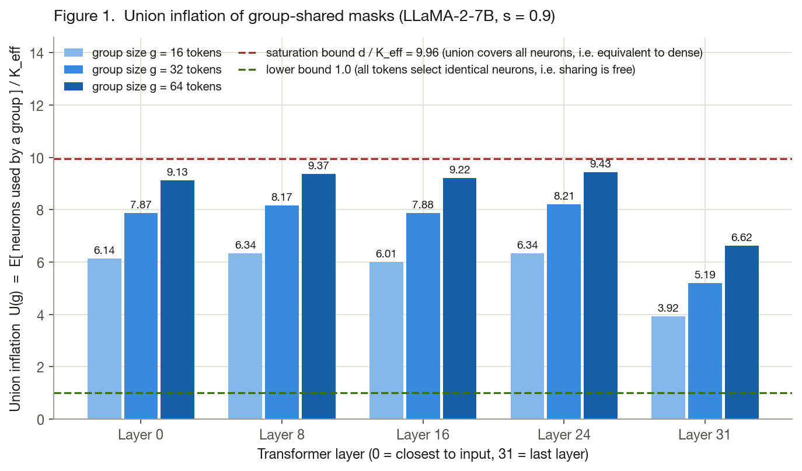
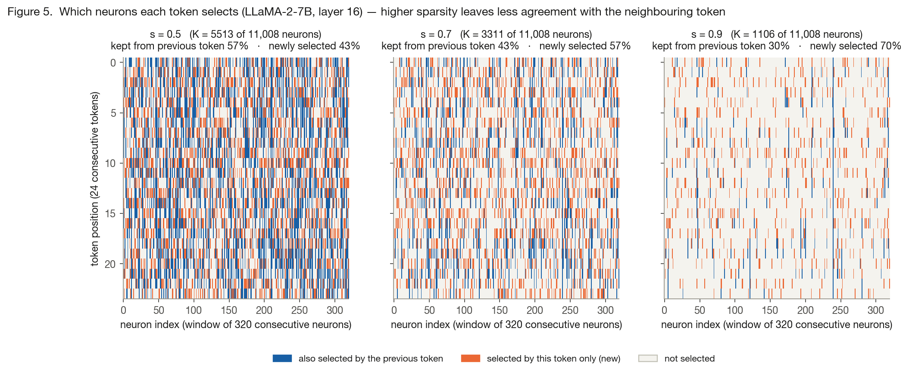
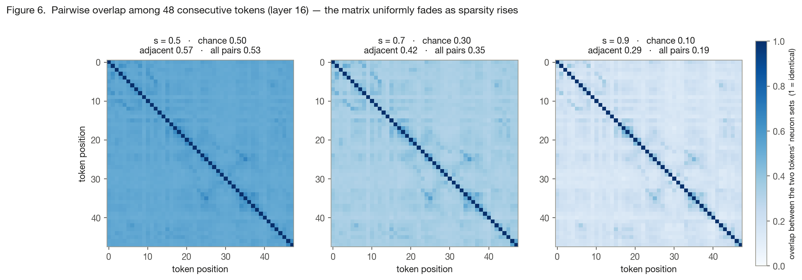
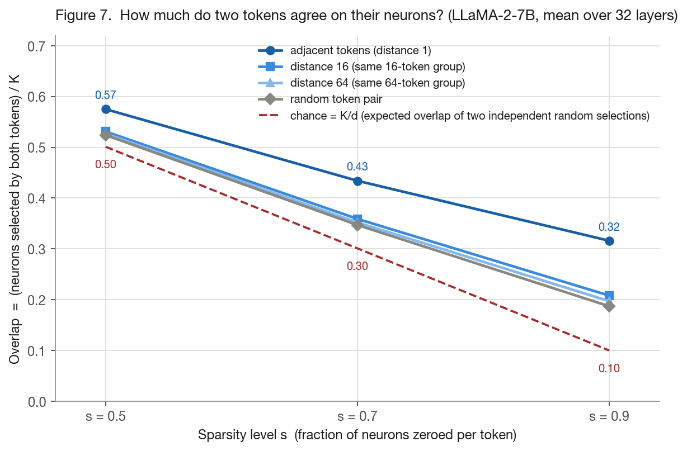
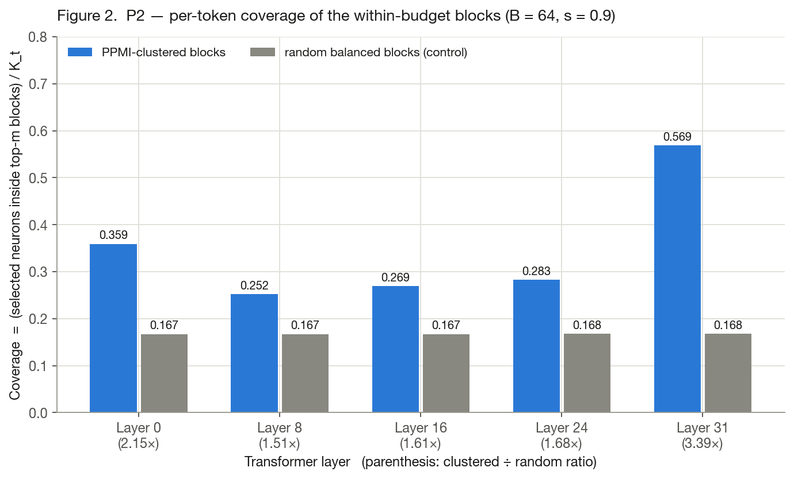
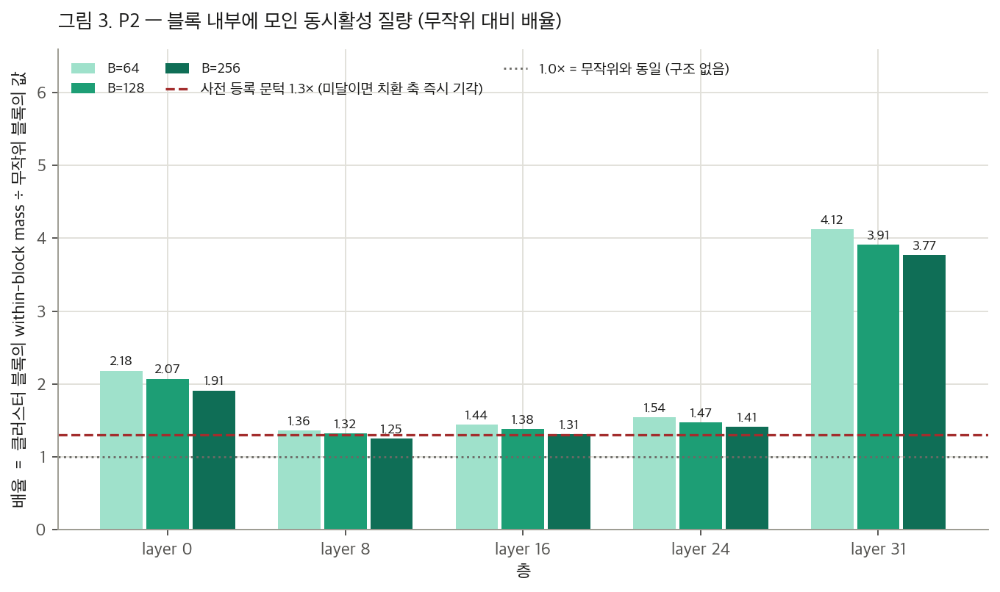
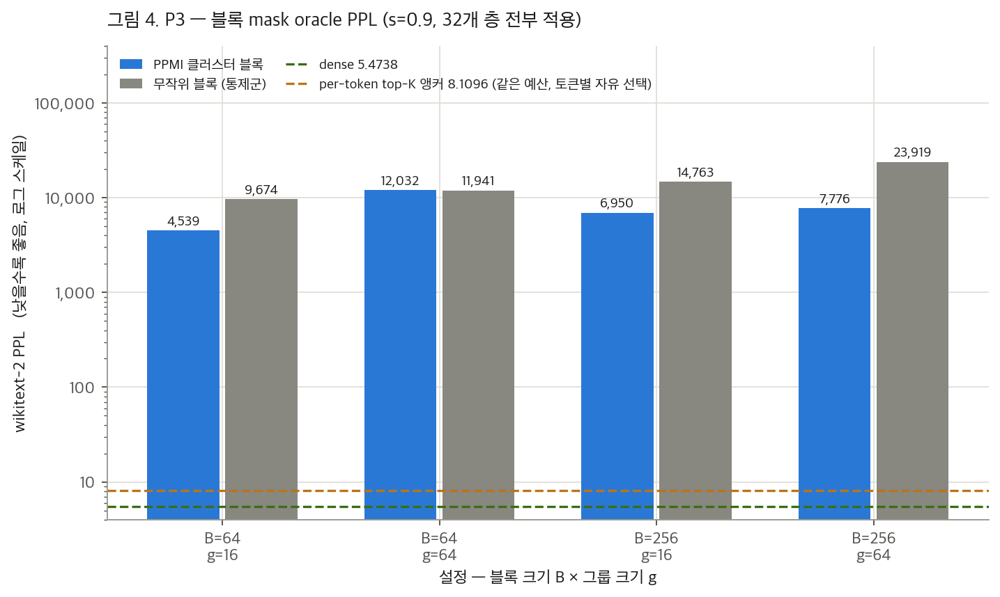

# Can Neuron Permutation Make Group-Shared Sparsity Masks Block-Structured? — A Three-Stage Study (P1–P3)

**Topic**: `coactivation-block-structure` · **Model**: LLaMA-2-7B · **Data**: WikiText-2 (test split)
**Experiments run**: 2026-07-25 · **Report**: 2026-07-28 · **Hardware**: one NVIDIA RTX A6000 (48 GB), host `a6000-4`
**Specification document**: `plans/coactivation-block-structure-spec.md` in the local `research-wiki` vault (not part of this repository)
**Journal cards**: `.labtool/topics/coactivation-block-structure/journal/` (one card per experiment)

---

## Abstract

Per-token Top-K sparsification of the feed-forward network (FFN) intermediate activation preserves language-model quality well, but it is inefficient on GPUs because every token activates a different subset of neurons. Sharing one neuron mask across a *group* of consecutive tokens would make the computation hardware-friendly, yet tokens disagree strongly on which neurons they need. This study asks whether a **permutation of the neurons** — a reordering that provably leaves the model's output unchanged — can reorganize the FFN into **blocks of co-activating neurons**, so that a group-shared mask becomes a cheap selection of a few blocks.

We ran a three-stage gated study on LLaMA-2-7B at sparsity s = 0.9. **P1** measured the raw cost of naive mask sharing: the union of neurons needed by a 64-token group covers 92–95 % of all neurons, i.e., naive sharing is almost equivalent to dense computation. **P2** showed that co-activation-based clustering finds genuine structure: clustered blocks capture 1.3–4.1× more co-activation than random blocks, passing our pre-registered threshold. **P3**, however, showed that this structure is insufficient: even with *oracle* block selection, perplexity explodes from 8.11 (per-token baseline) to 4,539–23,919 — missing the pre-registered success criterion by three to four orders of magnitude. We conclude that **permutation alone cannot make group-shared masks viable** at this sparsity level, although the discovered block structure remains reusable as a component (e.g., for reducing predictor output dimensionality, or combined with residual compensation). Total GPU time for the full study: approximately 32 minutes.

---

## 1. Introduction

### 1.1 Background: why share a mask across tokens?

The FFN of LLaMA-2-7B computes, for every token, an intermediate activation vector of dimension d = 11,008:

```
FFN(x) = W_down · i,      i = u ⊙ g,      u = W_up · x,      g = σ(W_gate · x)
```

where `x` is the token's hidden state, `⊙` denotes element-wise multiplication, and `σ` is the SiLU activation. We refer to each of the d coordinates of `i` as a **neuron**.

**Top-K sparsification** keeps, for each token, only the K = ⌊(1−s)·d⌋ neurons with the largest magnitude |i_j| and sets the rest to zero; `s` is the **sparsity level** (the fraction of neurons removed). At s = 0.9 each token keeps roughly 1,101 of 11,008 neurons, and prior work in this project confirmed the quality cost is moderate (perplexity 5.47 → 8.11 on WikiText-2).

The practical obstacle is efficiency. A GPU multiplies matrices fastest when it can load a contiguous tile of weights and reuse it across many tokens. If every token activates a *different* 10 % of the weight columns, memory access becomes scattered and the theoretical 10× saving largely evaporates. The standard remedy is **mask sharing**: let a group of `g` consecutive tokens (we test g = 16, 32, 64) use one common neuron mask, so weight tiles are loaded once per group. The cost of this remedy is the subject of this study, because a prior measurement in this project showed that even *adjacent* tokens disagree on about 68 % of their selected neurons at s = 0.9.

### 1.2 The idea under test: permutation as a free degree of freedom

The order in which neurons are numbered is arbitrary. If we apply a permutation π to the neuron indices — that is, simultaneously reorder the **rows** of `W_up` and `W_gate` and the **columns** of `W_down` in the same way — the function computed by the FFN is *exactly* unchanged, bit for bit. Formally, for any permutation matrix P:

```
W_down · i  =  (W_down Pᵀ) · (P i),
```

and `P i = (P u) ⊙ (P g)` because the element-wise product commutes with coordinate reordering. Permutation is therefore a **free degree of freedom**: it costs nothing at inference time and requires no retraining. (More generally, the only linear transforms that commute with the element-wise structure of `i = u ⊙ g` are *monomial* transforms — permutations composed with per-coordinate scaling — which is why we do not consider rotations here; rotated-basis variants belong to a separate research thread.)

This freedom suggests a hypothesis:

> **Hypothesis.** If neurons that tend to activate *together* are relocated (by permutation) into contiguous **blocks** of size B, then a group-shared mask can be expressed as a selection of a few blocks, and the disagreement between tokens can be absorbed at the block level rather than paid at the level of individual neurons.

### 1.3 Study design: three gates of increasing cost

We structured the study as three stages, each with a **pre-registered** success criterion — i.e., the pass/fail rule was written down *before* seeing the results, to prevent moving the goalposts afterwards. Each stage is cheaper than the next, and a failure at any stage stops the study:

| Stage | Question | Cost | Pre-registered criterion |
|---|---|---|---|
| **P1** | How expensive is naive sharing, and which neurons co-activate? | 1.5 min | (observational; sanity bounds only) |
| **P2** | Does co-activation clustering beat random reordering? | 3.4 min | ≥ 1.3× over random partitions, else reject the axis |
| **P3** | Does the block structure preserve perplexity? | 27 min | ΔPPL ≤ +1.0 vs. the per-token anchor |

---

## 2. Terminology and Notation

This section defines every term and symbol used below. Readers familiar with activation sparsity may skim Table 1 and return as needed.

**Table 1 — Notation.**

| Symbol | Definition | Value here |
|---|---|---|
| d | FFN intermediate dimension (number of neurons per layer) | 11,008 |
| L | number of transformer layers | 32 |
| s | sparsity level (fraction of neurons zeroed per token) | 0.9 |
| K | nominal per-token budget, ⌊(1−s)·d⌋ | 1,101 |
| K_eff | empirically measured mean number of surviving neurons | 1,104–1,108 |
| S_t | the set of neurons that survive Top-K for token t | \|S_t\| ≈ K_eff |
| f_j | selection frequency of neuron j (fraction of tokens that keep it) | measured |
| g | group size: number of consecutive tokens sharing one mask | 16 / 32 / 64 |
| B | block size: number of neurons per block after permutation | 64 / 128 / 256 |
| m | number of blocks selected per group, chosen so that m·B ≈ K | 17 (B=64), 4 (B=256) |

**Perplexity (PPL).** The standard language-modeling quality metric: the exponential of the average per-token negative log-likelihood on a held-out corpus. Lower is better; a model that predicts perfectly would have PPL 1. Dense LLaMA-2-7B achieves 5.4738 on our protocol. Values in the thousands indicate a model that has effectively lost the ability to model language.

**Co-activation.** Two neurons *co-activate* on a token if both survive that token's Top-K selection. Aggregated over many tokens, co-activation statistics reveal which neurons tend to be needed together.

**PMI and PPMI.** *Pointwise mutual information* compares how often two neurons actually co-activate against how often they would co-activate by pure chance if they were independent:

```
PMI(j, j′) = log [ P(j and j′ both selected) / ( f_j · f_j′ ) ].
```

The denominator `f_j · f_j′` is the co-activation rate expected under independence. PMI > 0 therefore means "these two neurons appear together *more* often than chance" — a genuine association — while PMI < 0 means they avoid each other. This normalization matters because two individually popular neurons will co-occur often by coincidence alone; raw co-occurrence counts would overrate such pairs. **PPMI** (*positive* PMI) is `max(0, PMI)`: negative values are clipped to zero, which is the standard preprocessing when a non-negative similarity matrix is required (as spectral methods do).

**Spectral clustering and balanced k-means.** To group 11,008 neurons using the 11,008 × 11,008 PPMI similarity matrix, we first compute a *spectral embedding*: the top 64 eigenvectors of the normalized similarity matrix give each neuron a 64-dimensional coordinate such that strongly associated neurons lie close together. We then run *balanced k-means* on these coordinates — a variant of k-means with a capacity constraint forcing every cluster to contain exactly B neurons. The balance constraint is essential: blocks of unequal size would defeat the hardware-efficiency purpose of blocking.

**Random balanced partition (control).** A partition of the d neurons into blocks of exactly B obtained from a uniformly random permutation. Any metric evaluated on clustered blocks is compared against the same metric on random partitions, because cutting neurons into blocks *at all* already captures some co-activation by chance; the comparison isolates the contribution of clustering itself.

**Oracle.** An *oracle* measurement gives the method under test information it would not have in deployment — here, the block selector sees the group's actual activation values. Oracle results are therefore **upper bounds**: a deployable predictor can only do worse. Testing the upper bound first is efficient, because if the upper bound already fails, the entire approach is refuted without building the predictor.

---

## 3. Common Experimental Protocol

- **Model and precision.** LLaMA-2-7B, bfloat16 weights; all statistics accumulated in fp32 (counts stay below 2²⁴, so fp32 accumulation is exact). Attention backend: PyTorch SDPA.
- **Sparsification.** `topk_intermediate` mode: per-token Top-K applied to `i` in every one of the 32 layers; attention left dense. This code path was previously validated to be bit-identical to dense at s = 0.
- **Measurement point.** All selection statistics are read by a forward hook on the input of `W_down` **during genuinely sparsified inference** — the selection at layer ℓ reflects the effect of sparsification in all earlier layers, unlike post-hoc analysis of dense activations.
- **Data.** WikiText-2 test set. Statistics (P1, P2): 32 sequences × 2,048 tokens = 65,536 tokens. Perplexity (P3): the full test set, 166 non-overlapping chunks of 2,048 tokens, identical for every arm.
- **Sampled layers (P1, P2).** Layers {0, 8, 16, 24, 31}. Storing a d × d matrix costs ~484 MB per layer, so we sample; layer 31 is always included because prior work identified it as the one layer with strongly concentrated neuron usage. P3 uses **all 32 layers**.

---

## 4. Experiment P1 — Co-activation Statistics and the Cost of Naive Sharing

> Job `20260725-000051-coact-llama2-p1-stats` · runtime 1 min 28 s · output `llama2_coactivation_s09.pt` (6.8 GB)

### 4.1 Purpose

P1 is purely observational. It collects (a) the **raw material** for clustering — which neurons co-activate — and (b) a quantitative measurement of **how expensive naive mask sharing would be**, before any solution is attempted.

### 4.2 What was computed

For every token we record the boolean survival vector over the d neurons, then accumulate exact counts (not samples) of:

```
f_j        selection frequency of neuron j
A(j, j′)   same-token co-activation:      fraction of tokens on which j and j′ both survive
A^g(j, j′) windowed co-activation:        the same, over token pairs at distance < g  (g = 16, 64)
```

`A` is accumulated as one matrix product per sequence (selᵀ·sel); `A^g` uses a cumulative-sum sliding window followed by one matrix product. Normalization constants are stored so that PMI can be derived downstream.

### 4.3 Metric: union inflation

When a group of g tokens shares a mask, the most permissive choice is the **union mask**: activate every neuron that *any* token in the group needs. We quantify its cost as:

| | |
|---|---|
| **Definition** | U(g) = E[ \|S_{t₁} ∪ … ∪ S_{t_g}\| ] / K_eff, the expected size of the group's union of selected-neuron sets, divided by the single-token budget |
| **Interpretation** | how many single-token budgets the union mask costs — the *inflation factor* of naive sharing |
| **Lower bound** | 1.0 — all tokens in the group select identical neurons; sharing is free |
| **Upper bound** | d / K_eff ≈ 9.96 — the union covers all d neurons; the "sparse" computation is equivalent to dense |

### 4.4 Results

**Table 2 — Union inflation U(g) at s = 0.9.**

| Layer | K_eff | g = 16 | g = 32 | g = 64 | g = 64, % of saturation |
|---|---|---|---|---|---|
| 0 | 1,105 | 6.14 | 7.87 | 9.13 | 92 % |
| 8 | 1,108 | 6.34 | 8.17 | 9.37 | 94 % |
| 16 | 1,107 | 6.01 | 7.88 | 9.22 | 93 % |
| 24 | 1,106 | 6.34 | 8.21 | 9.43 | 95 % |
| 31 | 1,105 | 3.92 | 5.19 | 6.62 | 66 % |



**How to read Figure 1.** The x-axis lists the five sampled layers, ordered from the input side (layer 0) to the final layer (layer 31). The y-axis is the union inflation factor U(g) defined above: the average number of neurons a group touches, expressed in multiples of the single-token budget K_eff. The three bars per layer correspond to group sizes g = 16, 32, and 64 tokens (darker = larger group). The red dashed line marks the saturation bound 9.96, at which the union covers all 11,008 neurons and sharing yields no sparsity at all; the green dashed line marks the ideal lower bound of 1.0. Numbers above each bar are the measured values — for example, 9.43 at layer 24 with g = 64 means a 64-token group touches on average 9.43 × 1,106 ≈ 10,430 distinct neurons.

### 4.5 Findings

1. **Naive union sharing is not viable.** At g = 64, layers 0–24 reach 92–95 % of the saturation bound: the union mask is nearly dense, so the sparse computation would save almost nothing. Even at the small group size g = 16 the budget inflates six-fold. Consequently, any surviving design must impose a **fixed budget** and select *within* it (top-m selection), rather than activating everything the group touches. This observation dictated the design of P3.
2. **Layer 31 is an outlier** (U(64) = 6.62 vs. 9.1–9.4 elsewhere), consistent with the prior finding that only this layer exhibits concentrated neuron usage (Gini coefficient 0.705). This accumulates evidence for layer-wise strategies (e.g., a fixed neuron set for the last layer).

### 4.6 Qualitative view: how differently do neighbouring tokens select?

Union inflation is an aggregate. To make the underlying phenomenon directly visible — and to show how it worsens with sparsity — we additionally dumped the raw survival pattern `sel[t, j]` for the first 256 tokens of one WikiText-2 sequence at s = 0.5, 0.7 and 0.9 (job `20260804-224920-coact-selection-slice`, 1 min; layers 0, 16 and 31 recorded, layer 16 shown here as a representative middle layer).



**How to read Figure 5.** Each panel is one sparsity level. Rows are 24 consecutive tokens (top to bottom, in reading order); columns are a window of 320 consecutive neuron indices — the window is arbitrary, since neuron order carries no meaning (Section 1.2). A cell is coloured when that token selected that neuron: **blue** if the *previous* token also selected it, **orange** if the token selected it anew. Pale cells are unselected. The panel headings give the fraction of each token's selection that is inherited from its neighbour versus newly chosen. Reading left to right, the colour balance inverts: at s = 0.5 a majority of each token's selection is shared with its predecessor (blue-dominated), whereas at s = 0.9 most of it is new (orange-dominated), even though the neurons are physically adjacent in the same window. In other words, tokens that are next to each other in the text largely disagree about which neurons matter, and they disagree more as the budget shrinks.



**How to read Figure 6.** Each panel shows a 48 × 48 matrix over 48 consecutive tokens; both axes are token position, and cell (t, t′) is the overlap between the two tokens' selected-neuron sets, i.e. the number of neurons chosen by both divided by K. Darker means more agreement, and the colour scale (0 to 1) is shared across the three panels, so they can be compared directly; the diagonal is 1 by construction. Two observations follow. First, the matrix fades uniformly as sparsity increases: mean pairwise overlap drops from 0.53 (s = 0.5) to 0.36 (s = 0.7) to 0.19 (s = 0.9). Second, there is no pronounced dark band along the diagonal — adjacent tokens (0.57 / 0.42 / 0.29) are only modestly above the all-pairs average, which is precisely why grouping *consecutive* tokens buys so little.

Both effects are quantified in Figure 7, which uses the full 32-layer measurement from the preceding overlap study.



**How to read Figure 7.** The x-axis is the sparsity level; the y-axis is the mean overlap between two tokens' selected-neuron sets, as a fraction of the budget K. The four solid lines correspond to token pairs at increasing separation — adjacent, 16 apart (the span of a g = 16 group), 64 apart (a g = 64 group), and randomly paired within the sequence. The red dashed line is the chance level K/d expected if the two selections were statistically independent. Adjacent tokens keep a visible margin above chance at every sparsity (0.57 vs. 0.50, 0.43 vs. 0.30, 0.32 vs. 0.10 — a *relative* advantage that in fact grows with s, reaching 3.2× chance), yet in *absolute* terms the agreement falls steadily, and the lines for distances 16 and 64 lie almost on top of the random-pair line. The practical consequence is that the tokens a group-shared mask must serve are, in absolute terms, most dissimilar exactly where sparsity is most valuable.

---

## 5. Experiment P2 — Clustering and Structural Evaluation

> Job `20260725-004032-coact-llama2-p2-blocks` · runtime 3 min 23 s · output `llama2_coactivation_blocks_s09.pt` (5.1 MB)

### 5.1 Purpose and pre-registered rejection rule

P2 is a cheap screening gate before the expensive perplexity experiment. The question: *does clustering by co-activation find structure that a meaningless reordering would not?*

> **Pre-registered rule.** If clustered blocks fail to exceed random balanced partitions by at least **1.3×** on the structural metrics, the permutation axis is rejected outright and P3 is not run.

### 5.2 Method: from co-activation counts to a neuron ordering

The clustering pipeline turns the two raw count arrays produced by P1 into a single integer vector that assigns every neuron to a block. It consists of five steps, each of which is described below with its motivation. Implementation: `analyze_coactivation_blocks.py` (P2) and `p3_collect_cluster_all.py` (P3 preparation); both use the same routine.

**Step 1 — Counts to probabilities.** P1 stores `freq[j]`, the number of tokens for which neuron j survived, and `A[j, j′]`, the number of tokens for which neurons j and j′ *both* survived, over 65,536 tokens. Dividing by the token count gives the selection probability `f_j` (approximately 0.1 at s = 0.9) and the joint probability `A(j, j′)`.

**Step 2 — Chance correction (PPMI).** If two neurons were statistically independent, their joint probability would be `f_j · f_j′ ≈ 0.01`. An observed joint probability of, say, 0.03 is therefore three times the chance level, and receives a score of log 3 ≈ 1.1. Applying this to all pairs gives the association matrix

```
W(j, j′) = max( 0,  log[ A(j, j′) / (f_j · f_j′) ] ),     W(j, j) = 0,
```

an 11,008 × 11,008 matrix in which large entries mark genuinely associated pairs rather than merely popular ones. The diagonal is zeroed because a neuron's association with itself carries no grouping information.

**Step 3 — Degree normalisation.** We form `W_n = D^(−1/2) · W · D^(−1/2)`, where D is the diagonal matrix of row sums of W. Without this step, "hub" neurons with large total association mass dominate every cluster; the normalisation is the standard preprocessing of spectral clustering and equalises each neuron's influence.

**Step 4 — Spectral embedding: from a similarity table to coordinates.** Clustering algorithms such as k-means operate on points with coordinates, whereas we have only a table of pairwise scores — analogous to being given a table of pairwise affinities between cities and being asked to draw a map on which affine cities lie close together. Computing the eigendecomposition of `W_n` and retaining the eigenvectors of the 64 largest eigenvalues assigns to each neuron a 64-dimensional coordinate vector with exactly this property; each row is then normalised to unit length, so that subsequent distance comparisons are equivalent to cosine similarity. The truncation to 64 dimensions retains the dominant structure of the 11,008-dimensional similarity table while discarding noise.

**Step 5 — Capacity-constrained (balanced) k-means.** Ordinary k-means would produce clusters of widely varying size, which defeats the hardware-efficiency purpose of blocking. We therefore impose a capacity constraint of exactly B neurons per block. Each of 25 iterations performs:

```
distances = cdist(X, centroids)                    # every neuron to every block centre
order     = argsort(min-distance per neuron)       # most confidently assigned neurons first
for each neuron in order:
    assign it to its nearest centroid that still has free capacity
centroids = mean of the neurons assigned to each block
```

The greedy pass resembles a capacity-limited admission process: neurons are considered in order of confidence, each takes the best block still having a vacancy, and blocks close once they hold B members. Iteration stops early if the assignment is unchanged.

**Output.** A single vector `assign` of length 11,008, mapping each neuron to a block index in {0, …, d/B − 1}; one such vector per layer and per block size. Note that the model weights are never physically reordered: representing blocks as *index sets* is mathematically equivalent to permuting the weights and taking contiguous blocks (Section 1.2), and is simpler to implement. A production kernel would apply the physical permutation once, offline, to realise the memory-locality benefit; the accuracy measurements reported here are unaffected by that choice.

Each clustered partition is compared against random balanced partitions — three seeds in P2, one in the P3 preparation — obtained by cutting a uniformly random permutation into equal blocks.

**Why clustering was run twice.** P2 clusters the five sampled layers for B ∈ {64, 128, 256} with three random controls, which suffices for structural metrics. P3 requires a partition for *every* layer, because perplexity is measured with all 32 layers masked simultaneously; its preparation job therefore re-runs the identical algorithm over all 32 layers for B ∈ {64, 256} with one random control. The algorithm is unchanged; only its scope differs.

### 5.3 Metrics

**(1) Within-block co-activation mass.**

| | |
|---|---|
| **Definition** | Σ over same-block pairs (j ≠ j′) of A(j, j′), divided by the total off-diagonal Σ of A |
| **Interpretation** | the fraction of all co-activation "mass" that falls *inside* blocks — the quantity clustering directly tries to maximize |
| **Baseline** | for a random balanced partition the expected value is (B−1)/(d−1): 0.0057 (B=64), 0.0115 (B=128), 0.0232 (B=256). The measured random values matched these theoretical numbers exactly, which doubles as a correctness check of the pipeline |

**(2) Per-token coverage at budget.**

| | |
|---|---|
| **Definition** | for each token, rank blocks by how many of that token's selected neurons they contain, keep the top m (with m·B ≈ K), and compute (selected neurons inside those blocks) / K_t |
| **Interpretation** | a direct proxy for the loss a block mask will inflict: coverage 1.0 means the block mask reproduces the per-token selection perfectly; coverage 0.3 means 70 % of the token's needed neurons are cut |
| **Baseline** | random partitions score 0.12–0.17 — higher than the naive budget fraction m·B/d ≈ 0.099 because even random blocks benefit from picking each token's best-loaded blocks (an order-statistics effect) |

**(3) Block-level union tiling.**

| | |
|---|---|
| **Definition** | (number of blocks the group touches × B) / \|union of the group's selections\| |
| **Interpretation** | 1.0 means the union aligns perfectly with block boundaries; large values mean the union is smeared across many blocks |
| **Bounds** | 1.0 (perfect tiling) to d/\|union\| (every block touched) |

### 5.4 Results



**How to read Figure 2.** The x-axis lists the sampled layers; the number in parentheses under each layer is the ratio of the blue bar to the grey bar. The y-axis is per-token coverage at budget (metric 2), between 0 and 1: the fraction of a token's actually-selected neurons that fall inside the m best blocks for that token, under the same total budget as per-token Top-K. Blue bars are PPMI-clustered blocks; grey bars are the random-partition control. The figure shows B = 64; other block sizes behave similarly. Two things should be read together: the *ratios* (1.5–3.4×) favor clustering everywhere, but the *absolute* clustered values reach only 0.25–0.36 in the middle layers — 64–75 % of each token's needed neurons lie outside the budgeted blocks and would be cut.



**How to read Figure 3.** The x-axis lists the layers. The y-axis is the *ratio* of within-block co-activation mass (metric 1) between clustered and random partitions — the ratio is used, rather than raw mass, to remove the mechanical contribution of blocking itself, which the random baseline captures. The three bars per layer are block sizes B = 64, 128, 256; ratios shrink slightly as B grows because larger random blocks already capture more mass (the baseline rises). The red dashed line is the pre-registered rejection threshold of 1.3×; the dotted line at 1.0× would mean no structure beyond chance. Result: 13 of 15 (layer, B) configurations pass the threshold; the only failure is layer 8 with B = 256 (1.25×). Layer 31 stands out at 3.77–4.12×.

**Metric 3 turned out to be uninformative (saturated).** Clustered and random partitions produced *identical* values to two decimal places (e.g., 1.64 at g = 16 for every partition and every B). This is not a tie in quality: because the group union spans 62–92 % of all neurons (Section 4), *any* balanced partition has essentially every block touched, pinning the metric at its ceiling d/\|union\| regardless of partition quality. The practical implication is nonetheless important: the strategy "activate whichever blocks the group touches" cannot be rescued by better clustering; only budgeted top-m selection remains on the table.

### 5.5 Findings

The gate **passes**: co-activation structure is real and is not reproduced by random reordering. However, two warnings accompany the pass: (i) the union-tiling route is closed (above), and (ii) the absolute coverage of 0.20–0.36 in middle layers implies that a block mask at the per-token budget will discard 65–80 % of each token's signal. On this evidence we proceeded to P3 with explicitly lowered expectations.

---

## 6. Experiment P3 — Oracle Perplexity of Block Masks

> Jobs `20260725-033520-coact-llama2-p3-prep` (10 min 17 s; clusters all 32 layers) and `20260725-034614-coact-llama2-p3-ppl` (17 min 17 s) · outputs `llama2_p3_partitions_s09.pt` (11 MB), `llama2_p3_block_ppl_s09.pt`

### 6.1 Purpose

The final arbiter is language-model quality. P3 measures perplexity when **all 32 layers simultaneously** use group-shared block masks, with *oracle* block selection (Section 2): the selector scores blocks using the group's actual activations, which a deployable system could not observe in advance. The result is therefore an upper bound on what the permutation approach can achieve.

> **Pre-registered criterion.** A clear perplexity gain over the random-partition control, **and** a gap to the per-token anchor small enough to look compensable — provisionally ΔPPL ≤ +1.0 at s = 0.9.

### 6.2 Masking rule

For each group of g consecutive tokens, in every layer:

```
score(b)  =  Σ_{t ∈ group}  Σ_{j ∈ block b}   ‖W_down[:, j]‖₂ · |i_{t,j}|
keep the m = round(K/B) highest-scoring blocks;  every token in the group uses only those blocks' neurons.
```

The weight factor ‖W_down[:, j]‖₂ makes the score *gauge-invariant*: because `i = u ⊙ g` allows per-neuron rescaling to be shifted into the columns of `W_down`, the bare magnitude |i_j| is ambiguous, whereas ‖W_down[:, j]‖·|i_j| measures the neuron's actual contribution to the layer output. (This score definition is shared with the parallel oracle-compensation research thread.)

**Implementation.** The rule is applied by replacing `LlamaMLP.forward` (`p3_block_ppl.py`), so that a single loaded model can serve every arm: switching arms only rewrites per-layer attributes (mode, block-membership matrix, m, g). Three quantities are precomputed once per layer: the column norms `‖W_down[:, j]‖₂` (a vector of length d), the block-membership matrix M of shape [d, d/B] holding a one-hot row per neuron, and m. Table 4 traces one forward pass.

**Table 4 — Data flow of one masked forward pass** (one sequence of T = 2,048 tokens, g = 16, B = 64, m = 17, so d/B = 172 blocks).

| Step | Operation | Result shape | Meaning |
|---|---|---|---|
| 1 | `i = SiLU(W_gate x) ⊙ (W_up x)` | [2048, 11008] | intermediate activations, computed densely (this experiment measures accuracy, not speed) |
| 2 | `score = |i| · ‖W_down[:, j]‖` | [2048, 11008] | per-neuron output contribution |
| 3 | reshape to [128, 16, d], sum over the 16 tokens | [128, 11008] | one score vector per group of 16 tokens |
| 4 | multiply by M | [128, 172] | per-block score; because M is one-hot, this matrix product *is* the per-block sum |
| 5 | `topk(·, m = 17)` | [128, 17] | the 17 blocks each group keeps, i.e. 17 × 64 = 1,088 neurons (98.8 % of the budget K = 1,101) |
| 6 | multiply by Mᵀ, threshold | [128, 11008] | selection expanded back to neuron granularity |
| 7 | broadcast across the group, apply | [2048, 11008] | **all 16 tokens of a group share one mask** — the experimental manipulation |
| 8 | `W_down · (i ⊙ mask)` | [2048, 4096] | layer output |

A final partial group is handled separately by the same rule; with T = 2,048 and g ∈ {16, 64} no partial group arises. Step 4 is what makes this measurement an *oracle*: the block scores depend on the activations of every token in the group, including tokens later than the one being masked, so the selection is non-causal within a group and could not be reproduced at deployment time (Section 2).

**Perplexity protocol.** With the above active in all 32 layers, the WikiText-2 test set is processed as 166 non-overlapping 2,048-token chunks; the per-chunk cross-entropies against the shifted targets are summed, and perplexity is the exponential of the total negative log-likelihood divided by the total token count. Every arm uses this identical loop.

**Arms** (all measured under one identical protocol — full test set, 166 × 2,048 tokens):

| Arm | Description | Role |
|---|---|---|
| dense | no sparsification | quality ceiling |
| per-token Top-K | free per-token selection, same budget | **anchor**: the cost of *not* sharing |
| block / clustered | PPMI blocks + group sharing | treatment |
| block / random | random blocks + group sharing | **control**: isolates the value of structure |

### 6.3 Results

**Table 3 — WikiText-2 perplexity at s = 0.9 (lower is better).** Baselines: dense **5.4738**; per-token Top-K anchor **8.1096**. Both reproduce previously established reference values to four decimal places, validating the measurement pipeline.

| B | g | m | effective budget (m·B / K) | clustered | random | clustered − anchor |
|---|---|---|---|---|---|---|
| 64 | 16 | 17 | 98.8 % | **4,539** | 9,674 | +4,531 |
| 64 | 64 | 17 | 98.8 % | 12,032 | 11,941 | +12,024 |
| 256 | 16 | 4 | 93.0 % | **6,950** | 14,763 | +6,942 |
| 256 | 64 | 4 | 93.0 % | 7,776 | 23,919 | +7,768 |



**How to read Figure 4.** The x-axis shows the four tested configurations (block size B × group size g). The y-axis is WikiText-2 perplexity on a **logarithmic scale** — each gridline step is a factor of 10; a linear axis would flatten the two baselines (5.47 and 8.11) invisibly against values in the tens of thousands. Blue bars are clustered blocks, grey bars the random-block control. The green dashed line is the dense baseline (5.4738); the orange dashed line is the per-token Top-K anchor (8.1096), i.e., the quality achievable with the *same budget* when each token selects freely. The vertical distance from the orange line to a bar is the price of group sharing; the pre-registered criterion required this distance to be at most +1.0.

### 6.4 Findings

1. **The criterion is missed decisively.** The best block configuration (B = 64, g = 16) reaches PPL 4,539 against the required ≤ 9.11 — a shortfall of three to four orders of magnitude, not a borderline case. All block arms produce a model that has effectively ceased to function as a language model.
2. **Structure does transfer to function.** Clustered blocks beat random blocks in three of four configurations, by factors of 2–3 (the exception, B = 64 / g = 64, has both arms near 12,000, where damage is saturated and the comparison is uninformative). This independently confirms that the structure found in P2 is real — it is simply far from sufficient.
3. **The collapse is quantitatively consistent with P2.** Coverage of 0.20–0.36 per layer means each layer discards 65–80 % of the signal the per-token selection would have kept; compounded multiplicatively across 32 layers, the surviving signal is negligible. P2 predicted this failure at a total cost of 3.4 minutes; P3 confirmed it.
4. *Budget footnote.* The B = 256 arms run at 93 % of the anchor's budget (m = 4; m = 5 would overshoot to 116 %). This 7 % handicap cannot account for a four-order-of-magnitude gap and does not affect the conclusion.

---

## 7. Discussion

### 7.1 What is refuted

1. **Naive union sharing** (P1): at g = 64 the union mask covers ~92 % of all neurons — equivalent to dense computation.
2. **"Activate the touched blocks"** (P2): the tiling metric is saturated under any balanced partition; no clustering can rescue this route.
3. **Permutation + block masks as a standalone technique** (P3): even the oracle upper bound collapses at s = 0.9 with all layers masked. Since a deployable predictor can only perform worse than the oracle, this configuration is conclusively rejected.

### 7.2 What survives

1. **The union-inflation measurements** are design constraints for any future group-shared mask (including the rotation-based thread pursued elsewhere in the lab): budget inflation is 6× already at g = 16 and near-saturating at g = 64.
2. **The block partitions themselves are real, functional structure** (2–3× perplexity advantage over random blocks) and are stored for reuse (`llama2_p3_partitions_s09.pt`, all 32 layers, B ∈ {64, 256}). Two candidate uses: reducing a sparsity *predictor's* output space from 11,008 neurons to 43–172 blocks, and serving as the coarse skeleton in a blocks-plus-residual-compensation hybrid.
3. **Layer 31's exceptional concentration** was re-confirmed by all three experiments (lowest union inflation, highest clustering advantage ~4×, highest coverage 0.57), strengthening the case for per-layer strategies.

### 7.3 Methodological note

The full study cost about 32 GPU-minutes because each stage was designed to predict the next: P2's coverage numbers (0.20–0.36) anticipated P3's collapse before any perplexity was measured. Running the full perplexity sweep first would have cost hours and, on failure, offered no explanation of *why* it failed.

### 7.4 Status and next decision

The P3 journal card's interpretation section awaits confirmation. The proposed verdict — reject the permutation axis as a standalone technique; keep the partitions as a component; shift priority to the pre-specified follow-ups (learned local sparsity, or shared-backbone-plus-residual) — is pending the user's decision.

---

## 8. Reproducibility

### 8.1 Jobs and code snapshots

| Stage | Job ID | Git tag | Runtime | Status |
|---|---|---|---|---|
| P1 | `20260725-000051-coact-llama2-p1-stats` | `exp/2026-07-24_coact-llama2-p1-stats` | 1 m 28 s | ok |
| P2 | `20260725-004032-coact-llama2-p2-blocks` | `exp/2026-07-25_coact-llama2-p2-blocks` | 3 m 23 s | ok |
| P3 prep | `20260725-033520-coact-llama2-p3-prep` | `exp/2026-07-25_coact-llama2-p3-blocks` | 10 m 17 s | ok |
| P3 eval | `20260725-034614-coact-llama2-p3-ppl` | (same tag) | 17 m 17 s | ok |
| Qualitative dump (§4.6) | `20260804-224920-coact-selection-slice` | `c95fb43` | 1 m | ok |

### 8.2 Code (repository `aiha-choij/EfficientAI`, directory `larosa/scripts/`)

| File | Role |
|---|---|
| `analyze_coactivation.py` | P1 — collects A, A^g, f and union inflation |
| `analyze_coactivation_blocks.py` | P2 — PPMI clustering + structural metrics (static and dynamic) |
| `p3_collect_cluster_all.py` | P3 prep — all-32-layer statistics and clustering |
| `p3_block_ppl.py` | P3 eval — group-shared block-mask perplexity, four arms |
| `dump_selection_slice.py` | qualitative dump — raw per-token survival patterns (§4.6) |
| `results/reports/figs/make_report_figs.py` | regenerates Figures 1–7; Figures 1–4 and 7 from values transcribed out of the job logs, Figures 5–6 from `figs/fig_data_selection.npz` (small derived arrays committed alongside, so the 24 MB dump is not needed) |
| `results/reports/build_report_pdf.py` | builds the self-contained `.html` and print-ready `.pdf` from this Markdown source (figures embedded as base64, so both files stand alone outside the repository) |

### 8.3 Artifacts (host `a6000-4`, directory `~/workspace/analysis/`)

| File | Size | Contents |
|---|---|---|
| `llama2_coactivation_s09.pt` | 6.8 GB | P1: A, A^16, A^64, f for layers {0, 8, 16, 24, 31} with normalization constants |
| `llama2_coactivation_blocks_s09.pt` | 5.1 MB | P2: partitions and all structural metrics |
| `llama2_p3_partitions_s09.pt` | 11 MB | P3: block partitions for **all 32 layers** (B = 64, 256) + random controls |
| `llama2_p3_block_ppl_s09.pt` | 1.7 KB | P3: perplexity results, 10 arms |
| `llama2_selection_slice.pt` | 24 MB | §4.6: raw survival patterns, 256 tokens × 11,008 neurons, layers {0, 16, 31} × s ∈ {0.5, 0.7, 0.9} |

### 8.4 Known pitfalls (for future sessions)

- The dispatcher requires **absolute paths** for the qsub working directory (a literal `~` fails silently).
- Host `a6000-4` cannot reach GitHub; scripts must be copied through the gateway (`scp`).
- The `ELAPSED` column of `runs` includes queue wait; true runtimes come from the STARTED/FINISHED timestamps in each job's metadata.
- The upstream `eval_ppl.py` logging swaps its MLP/attention sparsity labels; all numbers in this report come from our own hooks and perplexity loop and are unaffected.
